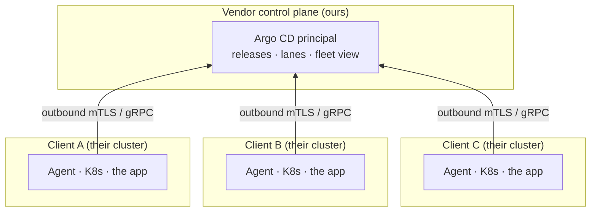

# byoc-demo

**BYOC on Kubernetes: how do you operate software you are not allowed to reach?**

You sell software. Your customers want to run it in their own cloud: their data, their cluster,
their rules (**bring-your-own-cloud**). You still have to ship upgrades, know what version each one
runs, and help when it breaks. But it is _their_ cluster and they will not hand you the keys. This
repo works that problem end to end, on a laptop.

## The challenge, stated precisely

A BYOC distribution model has to satisfy the hard constraints. The rest are what separate a demo
from a product.

**Must**

- Customers don't give you cluster-admin credentials
- The application runs inside their cluster
- You can distribute upgrades
- The customer controls which version they run
- You know what version they are running
- You can see health / status

**Ideally**

- Logs / diagnostics
- Rollback
- Air-gapped support

**Preferably**

- Open source
- No arbitrary customer limits

## The idea: flip the direction of trust

Instead of you reaching _into_ the customer's cluster, the customer's cluster reaches _out_ to you.
An **Argo CD agent** runs inside their cluster and opens one outbound mTLS connection to your
**Argo CD principal**. You publish desired state; the agent pulls it and applies it locally, then
reports status back up the same tunnel. You never hold a key to their cluster, it works behind NAT,
and "allow one outbound TLS destination" is the entire firewall ask.

> The client owns the infrastructure. The vendor owns the distribution lifecycle.



The arrows point _up_: the agent dials out to us. We never dial in.

The workload is **any Helm chart**; this demo ships **Activepieces** as the example. Each "client"
is a [vcluster](https://www.vcluster.com/) on one minikube node so you can watch a fleet at once; in
reality each is a separate real cluster (EKS/GKE/AKS/on-prem) and nothing about the model changes.

## Run it

First, the toolchain (pinned, so everyone gets the same versions):

```bash
direnv allow                 # or: nix develop
```

**1. Stand up your side: the control plane.** This is the vendor's HQ, before any client exists.

```bash
task up
```

It boots a local Kubernetes cluster called `byoc-control-plane`, installs Argo CD, and starts the
**argocd-agent principal**, the endpoint your clients' agents will dial into. No client is involved
yet; you are just opening for business.

**2. A rich client walks in.** They are, conveniently, called `rich-client`, and they want to run
your app in _their_ own cloud. If you just want to watch it happen, one command runs the whole
onboarding and seeds a starter flow:

```bash
task client:spin-up          # defaults to NAME=rich-client; runs 2a-2c below, then seeds a flow
```

But the point of BYOC is _who does what_, so here is the same thing split by side:

**2a. The client already has a cluster.** In the demo we fake one with a vcluster; in reality it is
their own EKS/GKE/AKS/on-prem.

```bash
task client:cluster NAME=rich-client
```

**2b. [Vendor] You register them and mint an install bundle.** This is the one step only you can do:
sign a client certificate against your CA, bound to their agent name. It runs entirely on your side
(you never touch their cluster) and emits one self-contained file: minimal Argo CD + the agent +
that identity + config pointing at your control plane.

```bash
task client:register NAME=rich-client        # -> .runtime/rich-client-agent-bundle.yaml
```

_Why a certificate at all?_ When the client's agent dials your control plane, the principal has to
answer one question before trusting anything it says: _is this really rich-client's agent, or
someone impersonating it?_ A shared password would be a secret you both store and either side can
leak. Instead the agent proves itself with a **client certificate**: a small signed document that
attests "the holder of this is `rich-client`", one that only your control plane could have issued.

_What mTLS is._ Ordinary HTTPS is one-sided: your browser checks the _server's_ certificate, the
server does not check your browser's. **mTLS** (mutual TLS) makes it symmetric. The agent verifies
the principal's server certificate (so the client knows it is really talking to _you_, not an
impostor sitting on the network), and the principal verifies the agent's client certificate (so you
know it is really rich-client). Both ends prove themselves, inside one encrypted connection that the
client opened _outbound_. No password ever crosses the wire, and there is no inbound port to attack.

_What a Certificate Authority is, and why you need one._ A certificate is only worth anything because
someone trusted signed it. That signer is the **Certificate Authority (CA)**: a keypair whose public
half everyone trusts and whose private half signs certificates. You generate it once, at `task up`:

```bash
argocd-agentctl pki init      # creates the CA keypair, stored as secret argocd/argocd-agent-ca
```

That one command is the root of your entire trust domain. The principal's own server certificate is
signed by it, and so is every client's. Because the principal holds the CA's public certificate, it
can check any agent certificate's signature and know instantly "yes, this chains to my CA" without
calling out to anything. Nobody can forge a valid agent certificate, because nobody else has the
CA's private key.

_Signing rich-client's certificate._ `client:register` asks that CA to issue exactly one certificate
whose name (the `CN`) is `rich-client`:

```bash
argocd-agentctl pki issue agent rich-client   # the CA signs a cert bound to CN=rich-client
```

Read straight out of the resulting bundle, the signature chain is visible:

```
subject= CN=rich-client            # who this agent is
issuer=  CN=argocd-agent-ca        # signed by your CA, which is why the principal trusts it
```

That certificate, plus the CA's public certificate (so the agent can verify _you_ in return), is
what goes into the bundle. On connect, the principal checks the signature against its CA, reads
`CN=rich-client`, and routes rich-client's Application to that agent. (Demo-honesty: this CA is a
throwaway that literally stamps `O=DO NOT USE IN PRODUCTION`, the certs are long-lived, and we mint
the client's key on your side and ship it. A production build swaps in a real PKI with short-lived,
rotating, revocable certs, and a CSR/registration-token enrollment so the client's private key is
generated on their side and never travels.)

**2c. [Client] They install it themselves. One command, in their own kube-context.** You packaged
the complexity; they do not hand-install six components.

```bash
task client:install-agent NAME=rich-client
# under the hood, the whole client-side experience is just:
#   kubectl apply --server-side -f rich-client-agent-bundle.yaml
```

The agent boots, dials _outbound_ to your control plane, authenticates with the bundled identity,
and your desired state (Activepieces) syncs down into their cluster. Notice what did **not** happen:
you never received a credential to their cluster. _They_ opened the connection to _you_. (In
production the bundle would be a signed OCI/Helm artifact handed over with a registration token, the
same shape as `helm install acme-agent --set registrationToken=...`; a plain manifest is the
laptop-friendly version.)

**3. Take stock of your fleet.** Do it in the control plane's own UI, not a bespoke tool.

```bash
task dashboard               # Argo CD UI at http://localhost:8081 (admin + printed password)
```

Argo CD shows every client as a destination, each app's sync and health, and the version it runs.
Look at _how_ the clients appear: as agents that dialed in, never as clusters you hold a kubeconfig
for. That absence is the whole trust model, visible on one screen.

**4. Ship them an upgrade, without touching their cluster.**

```bash
task lane:set NAME=rich-client LANE=latest
```

You change the desired version on _your_ side. It travels down `rich-client`'s existing outbound
tunnel; their agent pulls it and applies it locally. You just pushed a release into a cluster you
cannot reach.

**5. Change your mind, then roll it back.**

```bash
task rollback NAME=rich-client
```

Point them at a known-good lane again; the agent converges the cluster back to it.

**6. Someone breaks something in their cluster.** Simulate it: scale the app to zero behind Argo
CD's back.

```bash
task drift NAME=rich-client
```

Argo CD notices the drift and heals it back, again without you reaching in. Self-healing is a
property of the model, not a button you press.

**7. Preview a pull request** (this one runs on _your_ own cluster, so it is a plain Helm release, no agent):

```bash
task preview:open PR=123     # task preview:close prunes it
```

**8. Curtain down.**

```bash
task down                    # tear the whole thing back down
```
